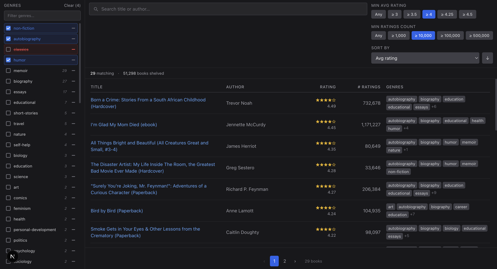

# Goodreads Advanced Search

**Live:** [Vercel App](https://goodreads-advanced-search.vercel.app/) · 

A genre-first book discovery tool built on top of Goodreads data. Find your next read by combining genres, filtering by rating, and searching by title or author — then jump straight to the Goodreads page for the full details.

---

## What it does

Most book discovery tools make you search for something specific. This flips that — start with a genre (or a combination of genres), set a minimum rating, and browse what's there.

- **Filter by multiple genres** — include what you want, exclude what you don't
- **Stack genre filters** — e.g. "fantasy" + "magic" − "romance" to narrow things down
- **Search by title or author** — fuzzy matching, works on partial words
- **Filter by average rating and number of ratings** — find acclaimed books or hidden gems
- **One click to Goodreads** — every result links directly to its Goodreads page for reviews, editions, and more
- **Works on any screen** — responsive layout with a genre drawer and card-based results on phones and tablets

The dataset has **50,000+ books and growing**, sourced from Goodreads genre shelves. Genre variants (e.g. `science-fiction` vs `sci-fi`) can be merged from the admin panel — merges apply at display time, never rewrite the underlying data, and are fully reversible.

---

## Why

This is a personal project — built for fun and to scratch a real itch. Goodreads has incredible data but its discovery experience is limited. This is an attempt to make genre-browsing actually useful.

---

## Tech

Next.js 15 · TypeScript · MongoDB Atlas · Tailwind CSS · Vercel

Tested with Vitest + Testing Library (`npm test`); the suite runs in GitHub Actions on every push to `main`.

See [`docs/`](docs/) for architecture and setup details.

---

## Disclaimer

This project is not affiliated with or endorsed by Goodreads. It's a personal, non-commercial tool. Data is sourced from publicly accessible Goodreads shelf pages.
